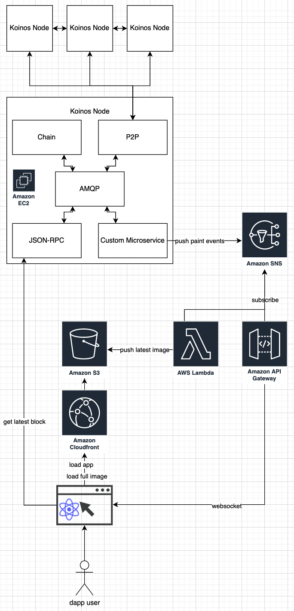

# One Million Single-Pixel NFTs

Pixels is a 1000x1000 shared canvas that anyone can paint. Each of the 1 million pixels is an NFT.

## Pixenomics

When you paint a pixel, you take ownership of the NFT.

First paint is free. Second is 0.01 [$KOIN](https://koinos.io). Each paint after that doubles the price.

75% of the paint fee goes to the NFT owner. 25% goes to the contract owner (me). This means that if someone "steals" your pixels, you make 50% ROI.

When no pixels have been painted for 7 days, they will lock and be unpaintable. A single 1000x1000 NFT of the full canvas will be minted and auctioned. The profits from that auction will be split between pixel holders.

## Running on Koinos

This design would be ridiculously expensive on Ethereum. Even on cheaper L1s/L2, the gas price of these transactions would rise rather quickly. It would be difficult to get traction in the early stage as someone would have to pay a lot just in gas to participate even if it was free to paint/mint the first time.

Koinos is the only free-to-use smart contract blockchain. You will pay zero gas for these transactions. What you will pay instead is called mana. Mana is a property of KOIN. Every 1 KOIN has 1 mana. You can spend mana and it will recharge. While your mana is recharging, an equivalent amount of KOIN is locked (non-transferrable). So, if it costs 0.05 mana to do a paint, then 0.05 of your KOIN will be locked while that mana recharges (a little every block).

## System Architecture

Subject to change. The app will run as a smart contract on Koinos (see `contract` folder). The front end (see `app` folder) will be hosted in AWS S3/CloudFront and talk directly to the blockchain at a node I will host. That node will have a custom microservice (see `microservice` folder) that just listens for `"pixels.paint"` events emitted by the smart contract. That microservice will publish events to an AWS SNS topic (see `infrastructure` folder). There will be an API Gateway subscription to the topic which will push paint events to the front end via websocket. There will also be an AWS lambda subscription to the topic which will keep `latest-canvas.png` and `${block-number}-canvas.png` in sync in AWS S3.

This infrastructure is not needed for the app to function directly with the blockchain but will aid in rendering the frontend performantly. Image data retrieved from S3 and paint events forwarded over websocket will be confirmed by querying the blockchain from the frontend.

